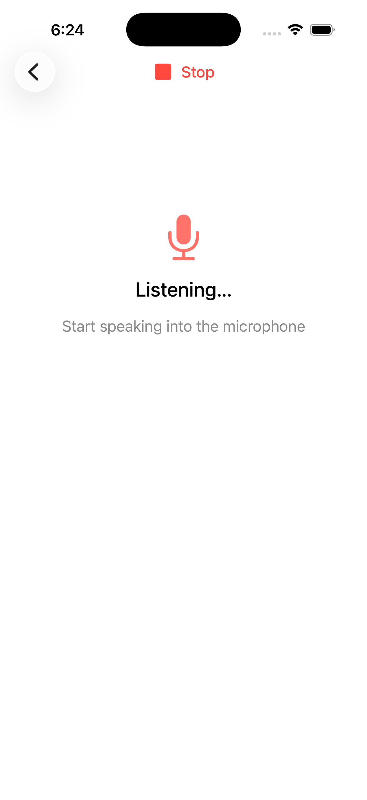
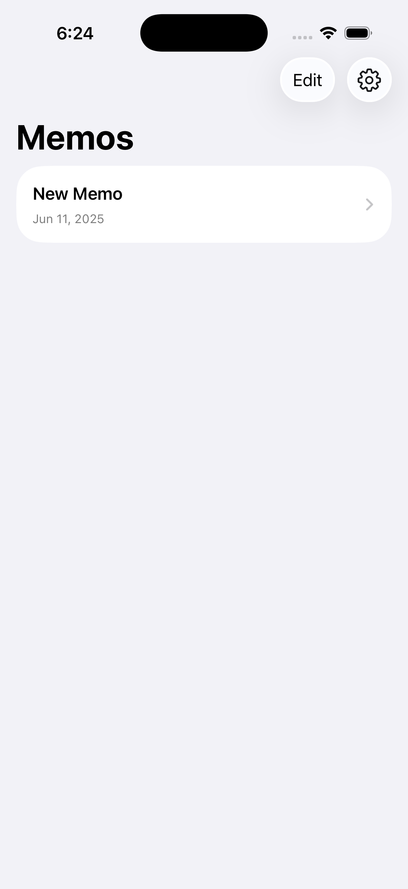

# Slipbox Scribe

An iOS/macOS application that combines Apple's SpeechAnalyzer framework with Foundation Models and Rich Text Editor capabilities for intelligent note-taking.

## Overview

Slipbox Scribe uses Apple's SpeechAnalyzer and SpeechTranscriber from iOS 26/macOS 26 for real-time, on-device speech-to-text transcription. It integrates with Foundation Models for on-device AI processing and uses the Rich Text Editor for advanced text editing capabilities.

All processing happens entirely on-device with no data leaving your device.


## Screenshots

<table>
  <tr>
    <td></td>
    <td></td>
  </tr>
</table>

## Features

- **Speech Transcription**: Real-time transcription using SpeechAnalyzer with volatile and finalized results, supports long-form audio and multiple languages
- **AI Processing**: On-device content analysis and organization using Foundation Models
- **Rich Text Editing**: Advanced text editing with AttributedString, custom formatting definitions, and dynamic attributes
- **Privacy**: Complete on-device processing with no cloud dependencies
- **Model Management**: Automatic speech model downloading and management via AssetInventory

## Requirements

- **iOS 26 Beta** or **macOS 26 Beta** (required for SpeechAnalyzer framework)
- **Xcode Beta** with latest toolchain
- Swift 6.0+
- Developer account with beta access
- Microphone permissions for transcription

## Installation

### For Development

1. Clone the repository:

   ```bash
   git clone https://github.com/slipboxai/swift-scribe
   cd swift-scribe
   ```

2. Open the project in Xcode:

   ```bash
   open SlipboxScribe.xcodeproj
   ```

3. Ensure you're targeting iOS 26 Beta/macOS 26 Beta in your deployment settings

4. Build and run the project using Xcode Beta

### Dependencies

- SpeechAnalyzer & SpeechTranscriber for speech recognition
- Foundation Models for on-device AI processing  
- AssetInventory for model management
- AttributedString for rich text editing
- AVFoundation for audio processing
- SwiftUI for UI

## Usage

1. Grant microphone and speech recognition permissions when prompted
2. Start recording to begin live transcription
3. Use the linking system to connect related ideas
4. Search and browse your knowledge base  
5. Export transcribed notes in various formats

## Use Cases

Fork and extend this project for your specific needs:

- **Meeting Note Taker**: Record and transcribe meetings with speaker identification and automated summaries
- **Medical Scribe**: Clinical documentation with medical terminology support and report generation
- **Lecture Transcriber**: Academic note-taking with chapter segmentation and key concept highlighting
- **Interview Assistant**: Journalist tool with question tracking and quote extraction
- **Legal Documentation**: Court proceedings and deposition transcription with timestamp accuracy
- **Research Tool**: Qualitative research interviews with theme identification and coding
- **Content Creation**: Podcast/video script generation with speaker notes and timestamps
- **Language Learning**: Foreign language practice with pronunciation feedback and vocabulary tracking
- **Accessibility Tool**: Real-time captions for hearing-impaired users with customizable formatting

## Architecture

- `Scribe/`: Core application logic
  - `Audio/`: Audio capture and processing
  - `Transcription/`: SpeechAnalyzer and SpeechTranscriber implementation
  - `Views/`: SwiftUI views with rich text editing
  - `Models/`: Data models for memos and transcription


## Roadmap

- Diarization and speaker identification
- Output audio tap

## License

This project is licensed under the MIT License - see the [LICENSE](LICENSE) file for details.

## Acknowledgments

- Inspired by WWDC 2025 sessions on SpeechAnalyzer, Foundation Models, and Rich Text editing
- Built with Apple's SpeechAnalyzer, Foundation Models, and Rich Text Editor frameworks

## Getting Started with Latest Features

If you're using **Cursor** or **Windsurf** IDE with AI agents, you can ask them to review the documentation files in the `Docs/` directory to understand the latest iOS 26/macOS 26 framework changes and implementation details.

The `Docs/` folder contains comprehensive WWDC 2025 session transcripts covering:

- SpeechAnalyzer and SpeechTranscriber APIs
- Foundation Models framework
- Rich Text Editor capabilities
- Audio processing improvements

## Support

If you encounter any issues or have questions:

- Open an issue on GitHub
- Check the documentation in the `Docs/` directory
